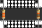

# Slideshow test

<link href="css/my_css.css" rel="stylesheet"/>

* [back to liblinks index](index.html)

Testing out what might work do do a simple slide show with (mostly) standard markdown content.

Start with a bare image, to see how github converts it to html, to figure out where to hang css rules

Add a header.  Might be able to reference than, even if end up hiding the actual element

## header level 2

### header level 3

Embedded image in a list

* 

* as nested list element
  * 

<!--
* [Link](#link_link)
## <a name="link_link">⚓</a> Link
-->

<!-- cSpell:disable -->
<!-- cSpell:enable -->
<!--
# cSpell:disable
# cSpell:enable
cSpell:words
cSpell:ignore liblinks
c Spell:enableCompoundWords
-->
