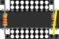
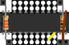

# Slideshow test

<link href="css/my_css.css" rel="stylesheet"/>

* [back to liblinks index](index.html)
* might need to [click to start](#slide1) the slide show

Testing out what might work do do a simple slide show with (mostly) standard markdown content.

## slides

* aa  bb <a href="slide1">sl1</a>
* cc  dd <a href="slide2">sl2</a>

<!--
* [Link](#link_link)
## <a name="link_link">⚓</a> Link
-->

<!-- cSpell:disable -->
<!-- cSpell:enable -->
<!--
# cSpell:disable
# cSpell:enable
cSpell:words
cSpell:ignore liblinks
c Spell:enableCompoundWords
-->

